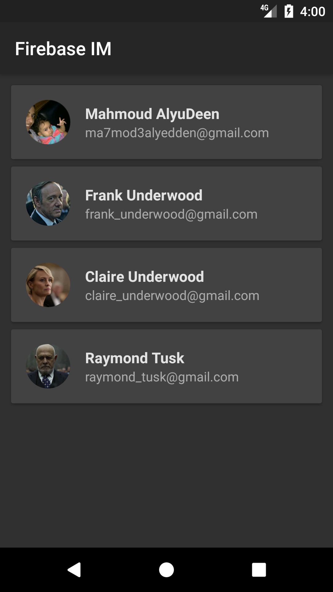
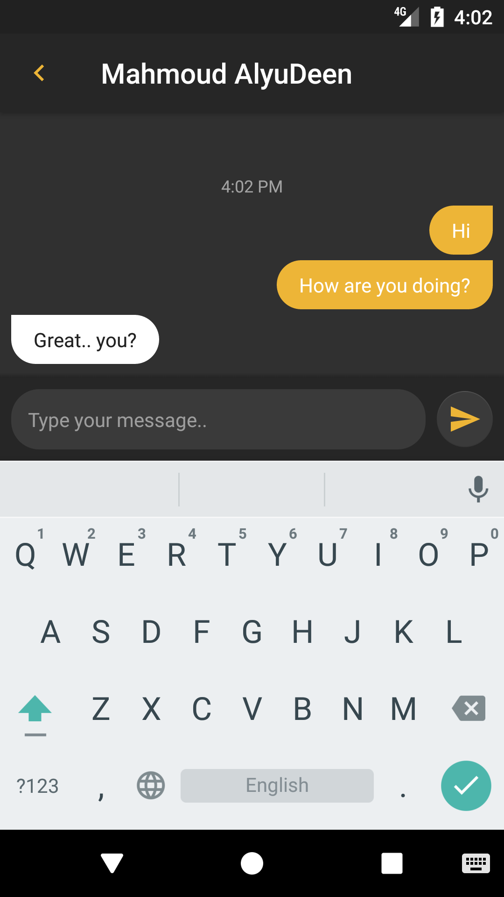
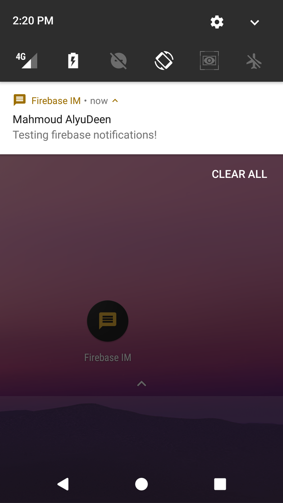

# FirebaseIM
A demo for Cloud Functions for Firebase, a basic instant messaging app with notifications
# Complete story
https://android.jlelse.eu/serverless-notifications-with-cloud-functions-for-firebase-685d7c327cd4
# Screenshots

  

# Testing
An APK is included for testing purposes.
Leave me a message through it! :)
